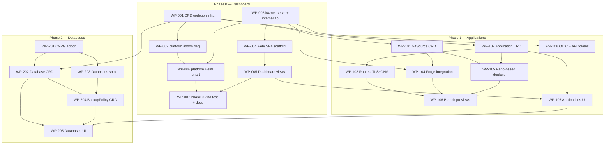

# k8zner Platform — Master Implementation Plan

This directory is the execution plan for the platform vision described in
[`../design/platform-vision.md`](../design/platform-vision.md). The vision doc is the
**why**; this plan is the **what and in which order**. It is written to be worked by
coding agents (or humans) one package at a time, without needing any other context.

Phases 0–2 are broken into numbered **work packages** (WP). Phases 3–5 are
deliberately kept at epic level in [`epics.md`](epics.md) — they will be planned in
detail when the earlier phases have taught us enough.

## How to work a package

1. Read this file, [`conventions.md`](conventions.md), and your WP doc — in that
   order. Follow every file-path anchor in the WP before writing code.
2. Work on a branch named `claude/wp-XXX-<slug>` (e.g. `claude/wp-003-serve`).
3. One WP per session/PR. Do not start a WP whose dependencies are not `done`.
4. **Definition of done** (every WP, in addition to its own acceptance criteria):
   - `make check` passes (fmt, lint, race tests, build).
   - New/changed behavior has tests following repo conventions.
   - CI wiring updated where the WP says so (package lists, jobs).
   - User-visible changes documented (`docs/`, `CHANGELOG.md`).
   - The status table below updated in the same PR.
5. WP docs are **living specs**: if reality diverges from the doc, update the doc in
   the same PR and note the deviation under a `## Deviations` heading.
6. Contracts frozen across lanes: `api/openapi.yaml` and `api/v1alpha1/` types.
   Change them only via the WP that owns them, or by updating the contract file and
   **all** consumers in one PR.

## Parallelization lanes

Independent lanes so multiple agents don't collide. Within a lane, order matters;
across lanes, work can proceed in parallel once shared dependencies are done.

- **Lane A — Go / CRD / operator**: WP-001 → WP-002 → WP-006 → WP-007, then
  WP-101 → WP-102 → WP-103 → WP-105 → WP-106, then WP-201 → WP-202 → WP-203 → WP-204
- **Lane B — API server (`internal/api`)**: WP-003 → WP-104 → WP-108
- **Lane C — Frontend (`web/`)**: WP-004 → WP-005 → WP-107 → WP-205

## Dependency graph

## Status

| WP | Title | Depends on | Status |
|----|-------|-----------|--------|
| [WP-001](wp-001-crd-codegen.md) | CRD codegen infrastructure | — | todo |
| [WP-002](wp-002-platform-addon-flag.md) | `platform` addon flag end-to-end | WP-001 | todo |
| [WP-003](wp-003-serve-command.md) | `k8zner serve` + `internal/api` | — | todo |
| [WP-004](wp-004-web-scaffold.md) | `web/` SPA scaffold + embedding | WP-003 | todo |
| [WP-005](wp-005-dashboard-views.md) | Dashboard views (read-only) | WP-004 | todo |
| [WP-006](wp-006-platform-chart.md) | `k8zner-platform` Helm chart | WP-002, WP-003 | todo |
| [WP-007](wp-007-phase0-test-docs.md) | Phase 0 integration test + docs | WP-005, WP-006 | todo |
| [WP-101](wp-101-gitsource-crd.md) | `GitSource` CRD + controller | WP-001 | todo |
| [WP-102](wp-102-application-crd.md) | `Application` CRD + controller | WP-001 | todo |
| [WP-103](wp-103-routes-tls-dns.md) | Automatic routes: TLS + DNS | WP-102 | todo |
| [WP-104](wp-104-forge-integration.md) | Forge integration (GitHub/GitLab) | WP-003, WP-101 | todo |
| [WP-105](wp-105-repo-deploys.md) | Repo-based deploys | WP-101, WP-102 | todo |
| [WP-106](wp-106-branch-previews.md) | Branch preview environments | WP-103, WP-104, WP-105 | todo |
| [WP-107](wp-107-applications-ui.md) | Applications UI | WP-005, WP-102 | todo |
| [WP-108](wp-108-oidc-auth.md) | OIDC auth + API tokens | WP-003 | todo |
| [WP-201](wp-201-cnpg-addon.md) | CloudNativePG addon | — | todo |
| [WP-202](wp-202-database-crd.md) | `Database` CRD + controller | WP-001, WP-201 | todo |
| [WP-203](wp-203-databasus-spike.md) | Databasus validation spike | WP-201 | todo |
| [WP-204](wp-204-backuppolicy-crd.md) | `BackupPolicy` CRD + controller | WP-202, WP-203 | todo |
| [WP-205](wp-205-databases-ui.md) | Databases & backups UI | WP-107, WP-202, WP-204 | todo |

Status values: `todo` → `in-progress (branch)` → `in-review (PR #)` → `done`.

## WP document template

Every WP doc has these sections — keep them when editing:

- **Goal** — one paragraph, outcome-oriented.
- **Context & anchors** — file paths and existing patterns to read first.
- **Contract** — what must be true after the WP is done (interfaces, behavior).
- **Non-goals** — explicitly out of scope (usually a later WP).
- **Acceptance criteria** — runnable/checkable, the reviewer's checklist.
- **Hints** — discovered patterns and suggestions; agents are free to deviate from
  hints, never from contracts.
